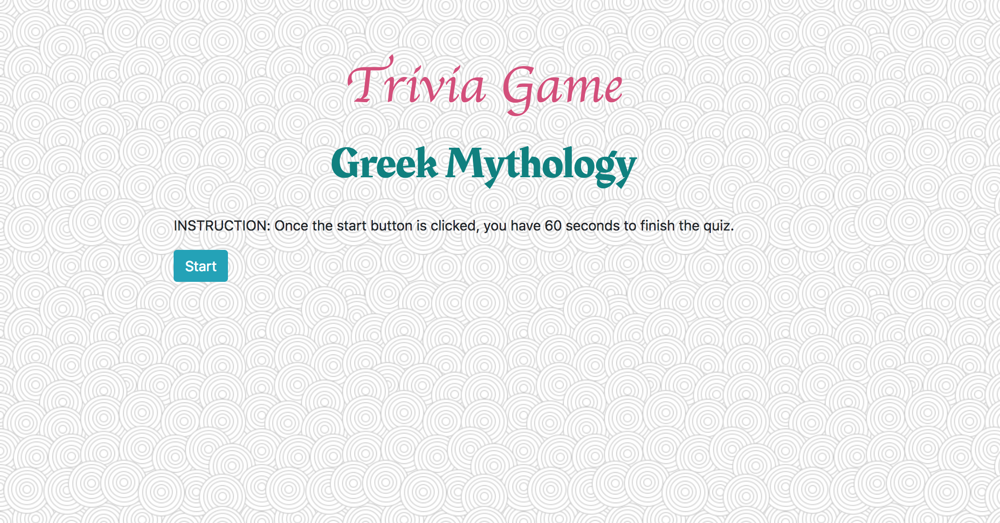
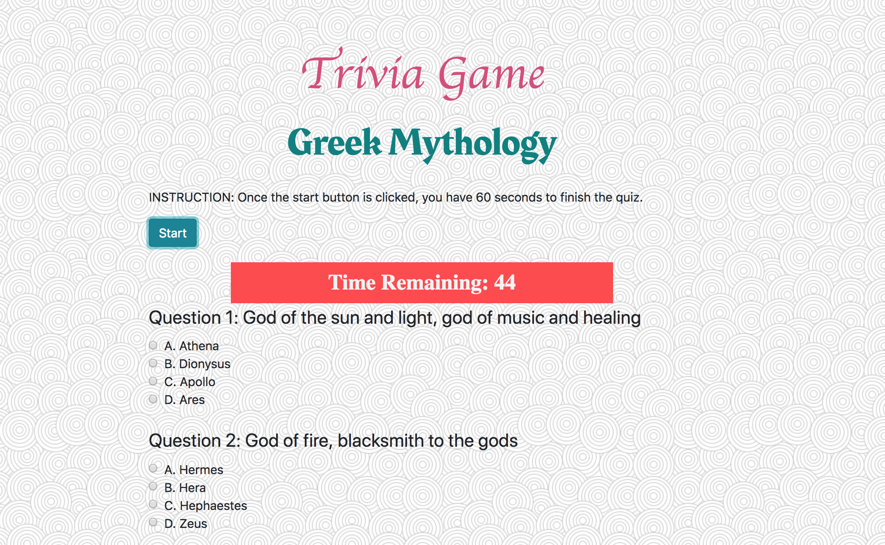
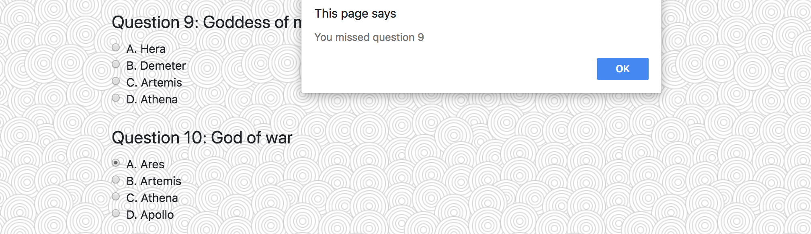
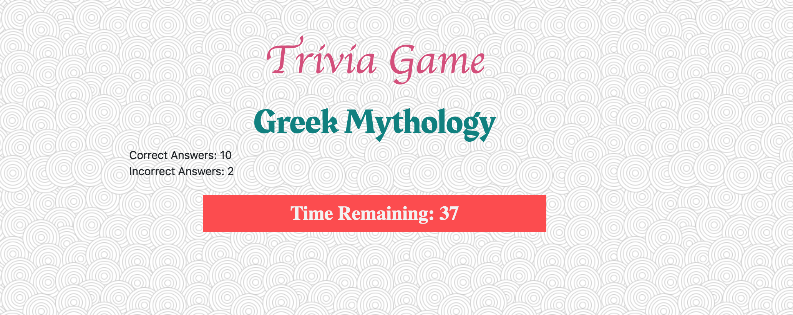
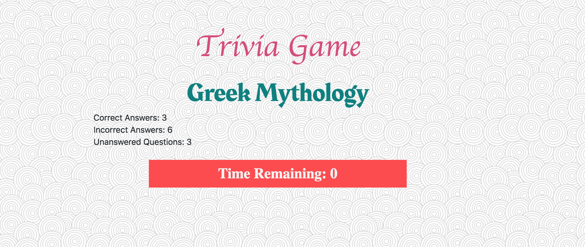

# Trivia Game
## Table of Contents 
1. [Overview](#overview)
2. [Technologies](#technologies)
3. [Installation](#installation)
4. [Game Display](#display)

## Overview

Trivia Game is a game project created using the knowledge of HTML, CSS, JavaScript, and jQuery. The theme of the game is Gods and Goddesses in Greek Mythology. There are a total of 12 questions. Each question provides a unique description of each God/Goddess, and the goal of the game is for the user to guess the name correctly. 

When the start button is clicked, the timer starts counting down from 60 seconds, and the questions are revealed. While the timer is counting down, if user clicks the submit button without choosing answers for all the questions, there will be an alert for the missed questions. If the user misses more than 1 question, it will alert the first question out of all the questions missed. Each missed question will be alerted until the user chooses all the answers. At this point, once the submit button is clicked and the timer is still counting down, the game will show the total correct and incorrect answers the user has chosen and the time remaining.

If the time runs out before the user can finish the game, it will show the total correct and incorrect answers the user has chosen, the unaswered questions, and the time remaining.

## Technologies
* .hide()
* .show()
* event.preventDefault()
* Timer methods: setInterval, clearInterval
* document.forms[index]
* .value
* eval()
* used 'return false' and 'return true' in the function
* Credit to the questions and answers: [greek-mythology-quiz]

[greek-mythology-quiz]: https://www.proprofs.com/quiz-school/story.php?title=greek-mythology-gods-goddesses-quiz

## Installation

Download the files to your computer from https://github.com/hyxhuynh/TriviaGame and open index.html using your browser (eg. Google Chrome)

Or visit: https://hyxhuynh.github.io/TriviaGame

## Game Display

* Start Screen

* After the Start button is clicked, timer starts counting down from 60 seconds.

* If the user clicks the Submit button and a question is missed, there will be an alert. 

* Time Remaing shown when the Submit button is clicked

* Time is up and the unanswered questions is shown. 

